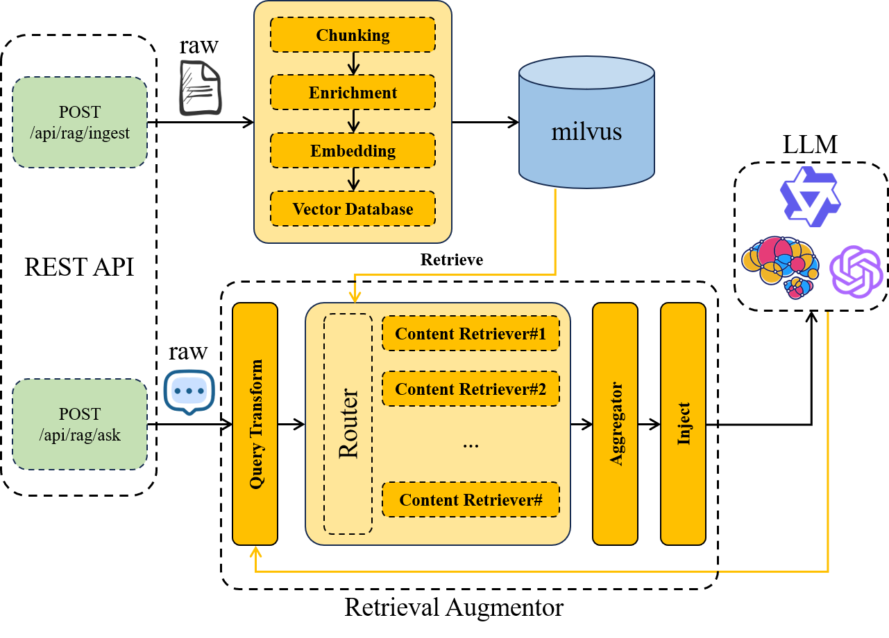
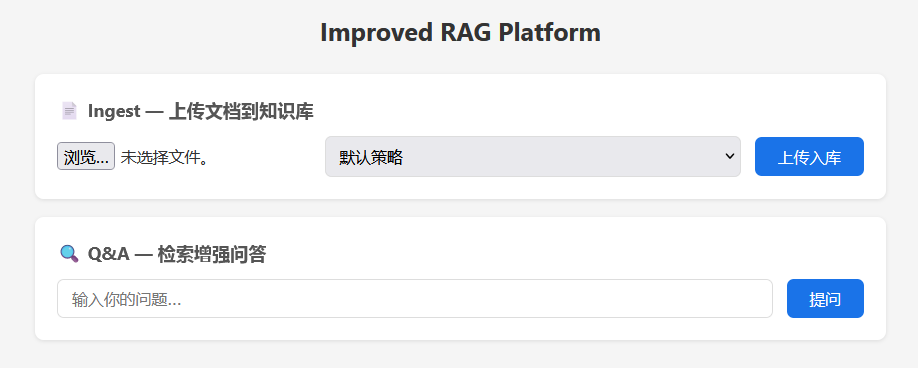

# Improved RAG Platform

基于 LangChain4j + Milvus + 通义千问的企业级 RAG 平台，支持多数据源独立存储、多路并行召回、RRF 融合、Reranker 精排。

## 架构



```
User Query
  │
  ▼
ExpandingQueryTransformer (N=3 查询变体)
  │
  ▼
DefaultQueryRouter (并行广播到所有数据源)
  │
  ├── tech_docs  → Milvus: kb_tech_docs  (maxResults=3, minScore=0.7)
  ├── faq        → Milvus: kb_faq        (maxResults=3, minScore=0.6)
  └── legacy     → Milvus: knowledge_base(maxResults=5, minScore=0.5)
  │
  ▼
RrfReRankAggregator
  RRF(k=60) → qwen3-rerank 精排 → topN=5
  │
  ▼
...
```

## 快速开始

### 1. 启动 Milvus

```bash
docker-compose up -d
```

Milvus 运行在 `localhost:19530`，Attu 管理界面在 `http://localhost:8000`。

### 2. 配置 API Key

编辑 `src/main/resources/application.yaml`，替换两处 `api-key`：

```yaml
langchain4j:
  chat-model:
    api-key: sk-xxx         # DashScope API Key
  embedding-model:
    api-key: sk-xxx

rag:
  reranker:
    api-key: sk-xxx         # Reranker 使用同一 Key，需在百炼控制台开通 qwen3-rerank 权限
```

如果未开通 Rerank 服务，可临时关闭：

```yaml
rag:
  multi-recall:
    enable-reranker: false
```

### 3. 启动应用

```bash
./mvnw spring-boot:run
```

浏览器打开 `http://localhost:8080`。

## 数据源配置

数据源通过 `application.yaml` 中的 `rag.datasources` 定义，每个数据源对应独立的 Milvus Collection：

```yaml
rag:
  datasources:
    - name: tech_docs
      collection: kb_tech_docs
      description: "技术文档和 API 参考"
      max-results: 3
      min-score: 0.7
      weight: 1.0
    - name: faq
      collection: kb_faq
      description: "FAQ 和操作指南"
      max-results: 3
      min-score: 0.6
      weight: 0.8
```

- `name`：数据源标识，Ingestion 时用 `source` 参数指定
- `collection`：对应的 Milvus Collection 名称
- `max-results`：该数据源每次检索返回的最大结果数
- `min-score`：向量相似度最低阈值
- `weight`：数据源权重（预留）

添加新数据源只需在 YAML 中增加一条，无需改代码。首次写入时自动创建 Collection。

## API

| 方法 | 路径 | 说明 |
|------|------|------|
| POST | `/api/rag/ingest` | 上传文档入库（可选参数 `source`、默认 `legacy`） |
| POST | `/api/rag/ingest/{strategy}` | 指定分块策略入库（RECURSIVE/PARAGRAPH/SENTENCE） |
| POST | `/api/rag/ask` | 检索增强问答 |

### 示例

```bash
# 上传文档到指定数据源
curl -X POST "http://localhost:8080/api/rag/ingest?source=tech_docs" -F "file=@api-reference.pdf"

# 指定分块策略
curl -X POST "http://localhost:8080/api/rag/ingest/RECURSIVE?source=faq" -F "file=@faq.md"

# 问答
curl -X POST http://localhost:8080/api/rag/ask \
  -H "Content-Type: application/json" \
  -d '{"question":"如何配置数据源？"}'
```

浏览器打开 `http://localhost:8080`，可直接在页面上传文档和提问：



## 召回管道配置

```yaml
rag:
  multi-recall:
    rrf-k: 60           # RRF 常数 k（标准值 60）
    top-n: 5            # 最终返回给 LLM 的结果数
    expander-n: 3       # 查询扩展变体数
    enable-reranker: true  # 是否启用 Reranker 精排

  reranker:
    model: qwen3-rerank
    base-url: https://dashscope.aliyuncs.com/compatible-api/v1/reranks
    api-key: sk-xxx
```

## 项目结构

```
src/main/java/com/improvedragplatform/
├── config/
│   ├── DataSourceProperties.java   数据源 + 多路召回参数配置
│   ├── DataSourceRegistry.java     多 Collection/Retriever 注册中心
│   ├── MilvusConfig.java           共享 MilvusServiceClient
│   ├── RagConfig.java              Embedding + Chat 模型 + RestClient
│   └── IngestionConfig.java        分块参数配置
├── ingestion/
│   ├── DocLoader.java              Apache Tika 文档加载
│   ├── DocChunker.java             多策略分块（递归/段落/句子）
│   ├── MetadataEnricher.java       元数据增强（source_name, file_name, chunk_index）
│   ├── EmbedStoreWriter.java       向量化 + 写入
│   └── IngestionPipeline.java      入库流水线编排
├── retrieval/
│   ├── Aggregator/
│   │   ├── RrfReRankAggregator.java  RRF 融合 + Reranker 精排
│   │   └── TopNContentAggregator.java 简单 TopN 聚合
│   ├── scoringModel/
│   │   └── DashScopeRerankerScoringModel.java  百炼 Reranker API
│   ├── ContentRetrieverFactory.java
│   ├── QueryRouterFactory.java     广播 / LLM 路由
│   ├── QueryTransformerFactory.java 查询压缩 / 扩展
│   ├── ContentAggregatorFactory.java
│   └── ContentInjectorFactory.java
├── service/
│   └── RagServer.java              多路召回管道组装
└── controller/
    ├── RagController.java          POST /api/rag/ask
    └── IngestionController.java    POST /api/rag/ingest
```

## 技术栈

- Spring Boot 3.5 + Java 21（虚拟线程并行检索）
- LangChain4j 1.1.0
- Milvus 2.4（Standalone，HNSW + COSINE）
- 通义千问 qwen-plus（Chat）/ text-embedding-v4（Embedding）/ qwen3-rerank（Reranker）
- 支持所有 OpenAI 兼容 API（修改 `base-url` 和 `model-name` 即可切换）

## 切换 LLM 提供商

修改 `application.yaml` 中 `langchain4j.*.base-url` 和 `model-name` 即可切换至 DeepSeek、硅基流动等 OpenAI 兼容服务。
